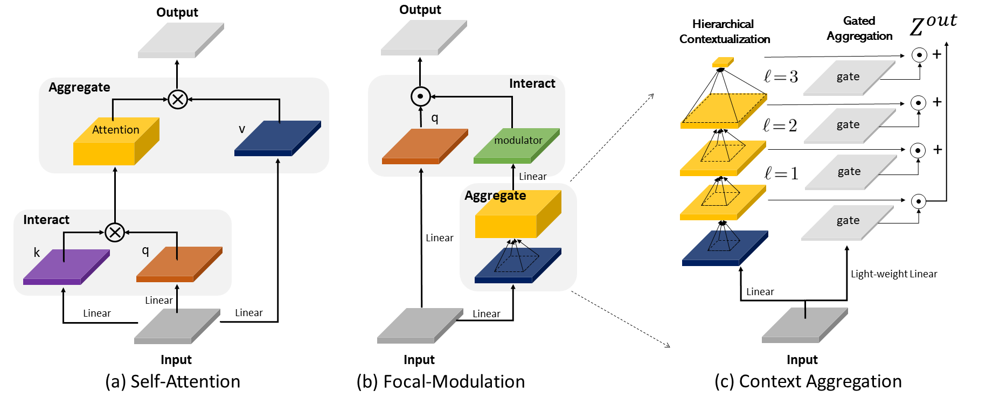
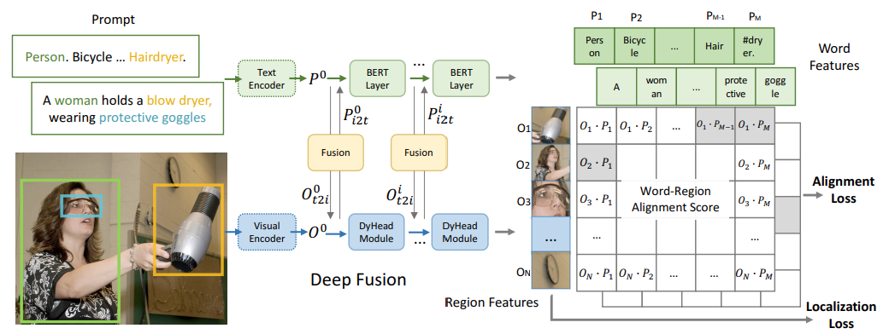
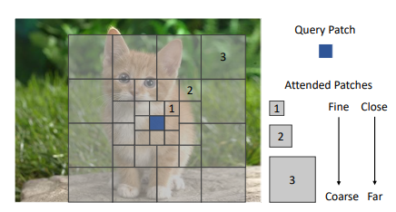

Hi, I am a senior researcher in [Deep Learning Group](https://www.microsoft.com/en-us/research/group/deep-learning-group/) at Microsoft Research, Redmond, directed by [Dr. Jianfeng Gao](http://research.microsoft.com/en-us/um/people/jfgao/). My research interests span in computer vision, vision & language and machine learning. More specifically, my primary researches are about structured visual understanding at different levels and how to further leverage them for intelligent interactions with human through language and environment through embodiment. I believe, by integrating fine-grained structured information, we can achieve better yet interpretable, grounded and robust multi-modality intelligent agent.

Prior to joining Microsoft at March 2020, I earned my Ph.D. in Computer Science from School of Interactive Computing at [Georgia Tech](https://www.gatech.edu) with thesis "Structured Visual Understanding, Generation and Reasoning". I was fortunte to be supervised by [Prof. Devi Parikh](https://cc.gatech.edu/~parikh/) and work closely with [Prof. Dhruv Batra](https://www.cc.gatech.edu/~dbatra/).

My current main research focuses:

* **Developing effective and efficient architectures for encoding different modalities of inputs, particularly vision**. Along this direction, we have developed a series of vision encoders, such as [Vision Longformer](https://arxiv.org/abs/2103.15358), [Focal Transformer](https://arxiv.org/abs/2107.00641) and [FocalNets](https://arxiv.org/abs/2203.11926).
* **Building generalist multi-modal learning paradigm for the computer vision in the wild, and further for embodiment or robotics**. We are the first few teams in this line of research, and have produced a series of works, like [UniCL](https://arxiv.org/abs/2204.03610), [RegionCLIP](https://arxiv.org/abs/2112.09106), [GLIP](https://arxiv.org/abs/2112.03857), [KLITE](https://arxiv.org/abs/2204.09222), and the foundation model [Florence](https://arxiv.org/abs/2111.11432) and generalist decoder [X-Decoder](https://x-decoder-vl.github.io/).

**If you are interested in working with me as a research intern on the above two topics, please feel free to drop me an email through jianwei.yang at microsoft dot com.**

<h2> News</h2>
 \[03/2023\] We are announcing the [2nd Computer Vision in the Wild (CVinW) Workshop at CVPR 2023](https://computer-vision-in-the-wild.github.io/cvpr-2023/)! Welcome to [submit your work](https://cmt3.research.microsoft.com/CVinW2023) and/or participate the [ICinW](https://eval.ai/web/challenges/challenge-page/1832/overview), [ODinW](https://eval.ai/web/challenges/challenge-page/1839/overview) and [SGinW](https://eval.ai/web/challenges/challenge-page/1931/overview) Challenges! 
 \[12/2022\] We released [X-Decoder](https://x-decoder-vl.github.io/), a generalist model for decoding pixel-level masks and token-level semantics seamlessly, achieving state-of-the-art open-vocab segmentation on 8 datasets, referring segmenation on RefCOCOg+ and instance/panoptic segmentation on ADE-20K! 
 \[12/2022\] Serving as an Area Chair for [ICCV 2023](https://iccv2023.thecvf.com/). 
 \[11/2022\] We wrote a [blog post](https://www.microsoft.com/en-us/research/group/deep-learning-group/articles/focalnets-focusing-the-eyes-with-focal-modulation/) to explain in a plain way our FocalNet and the different from Attention in terms of mechanism, interpretability and performance. 
 \[10/2022\] We scaled up our FocalNets to huge size, and achieved new SoTA on COCO object detection! [64.2 on minival](https://paperswithcode.com/sota/object-detection-on-coco-minival) and [64.3 on test-dev](https://paperswithcode.com/sota/object-detection-on-coco)! Check out our [new version](https://arxiv.org/abs/2203.11926) and [code](https://github.com/microsoft/FocalNet)! 
   \[09/2022\] Two papers got accepted by NeurIPS 2022, see you in New Orleans, AGAIN! 
   \[09/2022\] We are organizing [CV in the Wild Workshop and Challange](https://computer-vision-in-the-wild.github.io/eccv-2022/), submit your paper and method! 
  <!--  \[06/2022\] We are releasing the [code](https://github.com/microsoft/RegionCLIP) for our CVPR 2022 paper [RegionCLIP](https://arxiv.org/abs/2112.09106), and also a [live demo](https://huggingface.co/spaces/CVPR/regionclip-demo) on huggingface! 
   \[04/2022\] We are releasing our CVPR 2022 paper UniCL [paper](https://arxiv.org/abs/2204.03610) [code](https://github.com/microsoft/UniCL) [demo](https://huggingface.co/spaces/CVPR/unicl-zero-shot-img-recog) - a unified contrastive learning paradigm to learn discriminative and semantic-rich representations from image-label AND image-text data seamlessly! 
 \[03/2022\] We are releasing FocalNet [paper](https://arxiv.org/abs/2203.11926) [code](https://github.com/microsoft/FocalNet) - a simple, effective and attention-free architecture for vision! 
   \[03/2022\] Three papers got accepted by CVPR 2022, see you in New Orleans!  -->

<h2>Selected Preprints</h2>
<table cellspacing="0" cellpadding="0">
<tr>
<td style="padding:0px;width:30%;vertical-align:middle">
  
</td>
<td style="padding:20px;width:70%;vertical-align:middle">  
  <h3>Generalized Decoding for Pixel, Image, and Language.</h3>
  Xueyan Zou*, Zi-Yi Dou*, <b>Jianwei Yang</b>*, Zhe Gan, Linjie Li, Chunyuan Li, Xiyang Dai, Harkirat Behl, Jianfeng Wang, Lu Yuan, Nanyun Peng, Lijuan Wang, Yong Jae Lee☨, Jianfeng Gao☨.
   
  <em>arXiv</em>, 2022
   
  

    <a href="https://x-decoder-vl.github.io/">[project]</a>
    <a href="https://arxiv.org/pdf/2212.11270.pdf">[paper]</a>
    <a href="https://github.com/microsoft/X-Decoder">[code]</a>
    <a href="https://huggingface.co/xdecoder">[huggingface demo]</a>
  
  
</td>
</tr>
<tr>
<td style="padding:0px;width:30%;vertical-align:middle">
  
</td>
<td style="padding:20px;width:70%;vertical-align:middle">  
  <h3>Florence: A new foundation model for computer vision.</h3>
  Lu Yuan*, Dongdong Chen, Yi-Ling Chen, Noel Codella, Xiyang Dai, Jianfeng Gao, Houdong Hu, Xuedong Huang, Boxin Li, Chunyuan Li, Ce Liu, Mengchen Liu, Zicheng Liu, Yumao Lu, Yu Shi, Lijuan Wang, Jianfeng Wang, Bin Xiao, Zhen Xiao, <b>Jianwei Yang</b>, Michael Zeng, Luowei Zhou, Pengchuan Zhang. (Team member in alphabetic order)
   
  <em>arXiv</em>, 2021
   
  

    <a href="https://arxiv.org/pdf/2111.11432.pdf">[paper]</a>
    <a href="https://github.com/microsoft/UniCL">[research code]</a>
    <a href="https://www.microsoft.com/en-us/research/blog/azure-ai-milestone-new-foundation-model-florence-v1-0-pushing-vision-and-vision-language-state-of-the-art/">[blog]</a>
  
  
</td>
</tr>
</table>

<h2>Selected Publications</h2>
<table cellspacing="0" cellpadding="0">
<tr>
<td style="padding:0px;width:30%;vertical-align:middle">
  
</td>
<td style="padding:20px;width:70%;vertical-align:middle">  
  <h3>Focal Modulation Networks.</h3>
  <b>Jianwei Yang</b>, Chunyuan Li, Xiyang Dai, Lu Yuan and Jianfeng Gao.
   
  <em>NeurIPS</em>, 2022
   
  

    <a href="https://arxiv.org/abs/2203.11926">[paper]</a>
    <a href="https://github.com/microsoft/FocalNet">[code]</a>
    <a href="https://www.microsoft.com/en-us/research/group/deep-learning-group/articles/focalnets-focusing-the-eyes-with-focal-modulation/">[blog]</a>
    <a href="https://huggingface.co/spaces/jw2yang/focalnet-modulators">[huggingface demo]</a>
  
  
</td>
</tr>
<tr>
<td style="padding:0px;width:30%;vertical-align:middle">
  
</td>
<td style="padding:20px;width:70%;vertical-align:middle">  
  <h3>K-lite: Learning transferable visual models with external knowledge.</h3>
  Sheng Shen*, Chunyuan Li*, Xiaowei Hu, Yujia Xie, <b>Jianwei Yang</b>, Pengchuan Zhang, Anna Rohrbach, Zhe Gan, Lijuan Wang, Lu Yuan, Ce Liu, Kurt Keutzer, Trevor Darrell, Jianfeng Gao.
   
  <em>NeurIPS</em>, 2022. Oral
   
  

    <a href="https://arxiv.org/pdf/2204.09222.pdf">[paper]</a>
    <a href="https://github.com/microsoft/klite">[code]</a>
  
  
</td>
</tr>
<tr>
<td style="padding:0px;width:30%;vertical-align:middle">
  
</td>
<td style="padding:20px;width:70%;vertical-align:middle">  
  <h3>Grounded language-image pre-training.</h3>
  Liunian Harold Li*, Pengchuan Zhang*, Haotian Zhang*, <b>Jianwei Yang</b>, Chunyuan Li, Yiwu Zhong, Lijuan Wang, Lu Yuan, Lei Zhang, Jenq-Neng Hwang, Kai-Wei Chang, Jianfeng Gao.
   
  <em>CVPR</em>, 2022. Best Paper Final list
   
  

    <a href="http://openaccess.thecvf.com/content/CVPR2022/papers/Li_Grounded_Language-Image_Pre-Training_CVPR_2022_paper.pdf">[paper]</a>
    <a href="https://github.com/microsoft/GLIP">[code]</a>
    <a href="https://huggingface.co/spaces/haotiz/glip-zeroshot-demo">[huggingface demo]</a>
  
  
</td>
</tr>
<tr>
<td style="padding:0px;width:30%;vertical-align:middle">
  
</td>
<td style="padding:20px;width:70%;vertical-align:middle">  
  <h3>Regionclip: Region-based language-image pretraining</h3>
  Yiwu Zhong, <b>Jianwei Yang</b>, Pengchuan Zhang, Chunyuan Li, Noel Codella, Liunian Harold Li, Luowei Zhou, Xiyang Dai, Lu Yuan, Yin Li, Jianfeng Gao.
   
  <em>CVPR</em>, 2022
   
  

    <a href="http://openaccess.thecvf.com/content/CVPR2022/papers/Zhong_RegionCLIP_Region-Based_Language-Image_Pretraining_CVPR_2022_paper.pdf">[paper]</a>
    <a href="https://github.com/microsoft/RegionCLIP">[code]</a>
    <a href="https://huggingface.co/spaces/CVPR/regionclip-demo">[huggingface demo]</a>
  
  
</td>
</tr>
<tr>
<td style="padding:0px;width:30%;vertical-align:middle">
  
</td>
<td style="padding:20px;width:70%;vertical-align:middle">  
  <h3>Unified contrastive learning in image-text-label space.</h3>
  <b>Jianwei Yang</b>*, Chunyuan Li*, Pengchuan Zhang*, Bin Xiao*, Ce Liu, Lu Yuan, Jianfeng Gao.
   
  <em>CVPR</em>, 2022
   
  

    <a href="https://openaccess.thecvf.com/content/CVPR2022/papers/Yang_Unified_Contrastive_Learning_in_Image-Text-Label_Space_CVPR_2022_paper.pdf">[paper]</a>
    <a href="https://github.com/microsoft/UniCL">[code]</a>
    <a href="https://huggingface.co/spaces/CVPR/unicl-zero-shot-img-recog">[huggingface demo]</a>
  
  
</td>
</tr>
<tr>
<td style="padding:0px;width:30%;vertical-align:middle">
  
</td>
<td style="padding:20px;width:70%;vertical-align:middle">  
  <h3>Efficient self-supervised vision transformers for representation learning.</h3>
  Chunyuan Li, <b>Jianwei Yang</b>, Pengchuan Zhang, Mei Gao, Bin Xiao, Xiyang Dai, Lu Yuan, Jianfeng Gao.
   
  <em>ICLR</em>, 2022
   
  

    <a href="https://arxiv.org/pdf/2106.09785.pdf">[paper]</a>
    <a href="https://github.com/microsoft/esvit">[code]</a>
  
  
</td>
</tr>
<tr>
<td style="padding:0px;width:30%;vertical-align:middle">
  
</td>
<td style="padding:20px;width:70%;vertical-align:middle">  
  <h3>Focal attention for long-range interactions in vision transformers.</h3>
  <b>Jianwei Yang</b>, Chunyuan Li, Pengchuan Zhang, Xiyang Dai, Bin Xiao, Lu Yuan, Jianfeng Gao.
   
  <em>NeurIPS</em>, 2021, Spotlight.
   
  

    <a href="https://proceedings.neurips.cc/paper/2021/file/fc1a36821b02abbd2503fd949bfc9131-Paper.pdf">[paper]</a>
    <a href="https://github.com/microsoft/Focal-Transformer">[code]</a>
    <a href="https://www.google.com/url?sa=t&rct=j&q=&esrc=s&source=web&cd=&cad=rja&uact=8&ved=2ahUKEwjzk6Wm8NHyAhVCqlsKHYepD9wQtwJ6BAgDEAM&url=https%3A%2F%2Fwww.youtube.com%2Fwatch%3Fv%3DYH319yyeoVw&usg=AOvVaw27s7EE-txctmc6_BwKnnfE">[video]</a>
  
  
</td>
</tr>
<tr>
<td style="padding:0px;width:30%;vertical-align:middle">
  
</td>
<td style="padding:20px;width:70%;vertical-align:middle">  
  <h3>Taco: Token-aware cascade contrastive learning for video-text alignment.</h3>
  <b>Jianwei Yang</b>, Yonatan Bisk, Jianfeng Gao.
   
  <em>ICCV</em>, 2021
   
  

    <a href="https://openaccess.thecvf.com/content/ICCV2021/papers/Yang_TACo_Token-Aware_Cascade_Contrastive_Learning_for_Video-Text_Alignment_ICCV_2021_paper.pdf">[paper]</a>
  
  
</td>
</tr>
</table>
